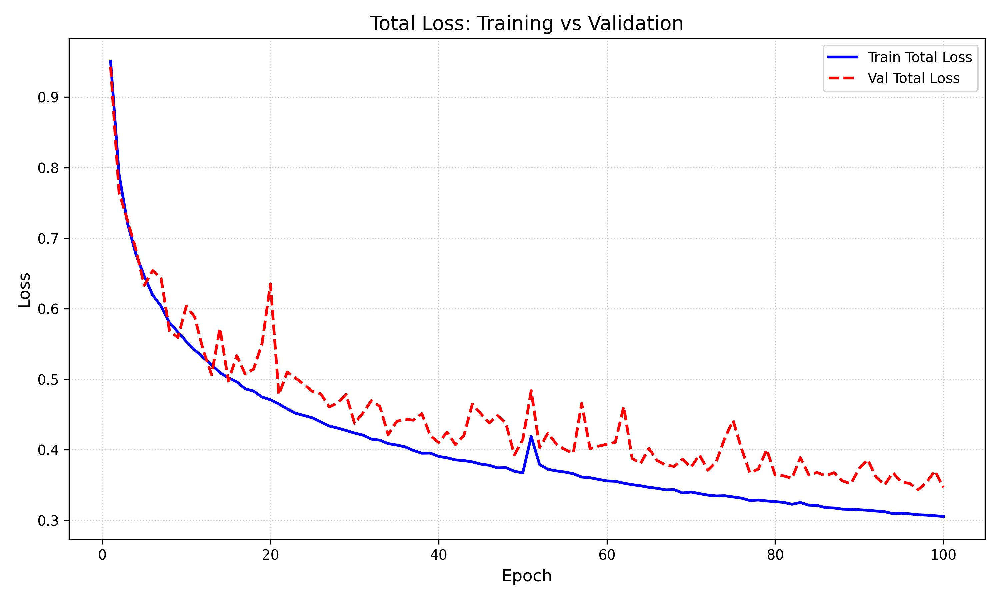

# Supervised FlowNet Implementation in TensorFlow

## Training the model

This runs on Python 3.11 and requires the following packages :
```
tensorflow
tqdm
matplotlib
```

To run the file, just open a terminal in the ```src``` folder and run the following command :
```bash
python train.py --data_path /yourdatapath --epochs 50 --batch_size 8 
```
The batch size and the learning rate are defined as defined in the [FlowNet: Learning Optical Flow with Convolutional Networks](https://arxiv.org/abs/1504.06852) paper. The learning rate is automatically set to ```1e-4```.

The losses (different scales and validation) will be written in a file called ```training_log.txt```. At the end of training, the weights will be saved as ```flownet.weights.h5```.

## Results

After running on the [FlyingChairs Dataset](https://lmb.informatik.uni-freiburg.de/resources/datasets/FlyingChairs.en.html) for 200 epochs, we obtain the following loss curves : 




## Visualizing the results

To visualize the results you can use the Flow Viewer. Results yeald : 

FlowNet Output            |  Groundtruth
:-------------------------:|:-------------------------:
  |  


